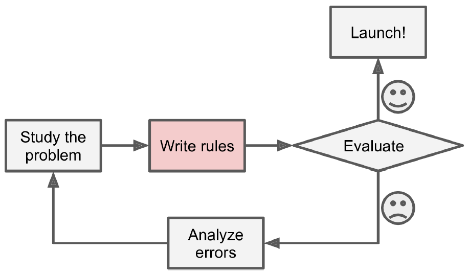
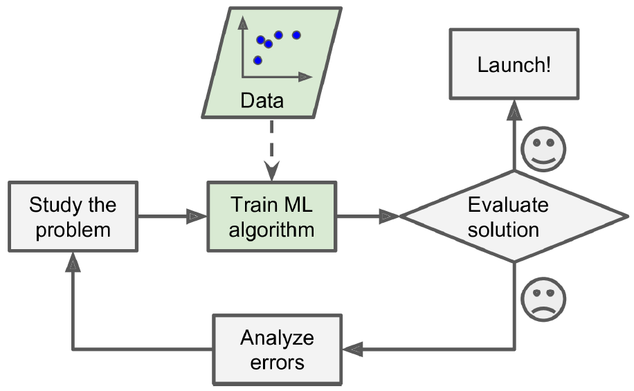
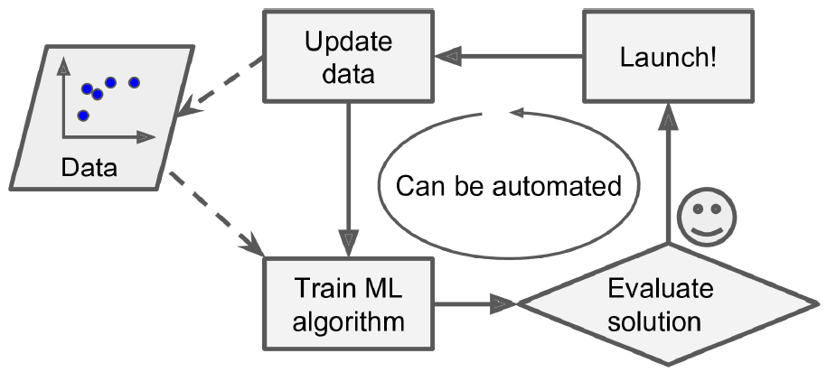
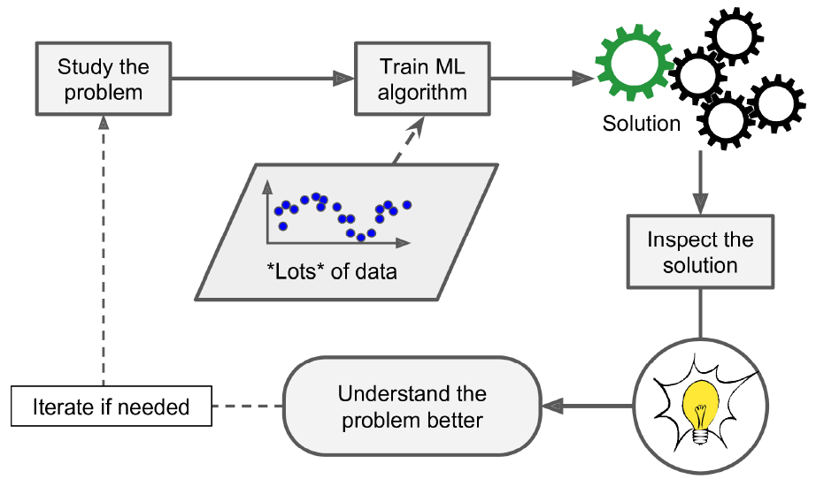

```{r setup, include=FALSE, cache=FALSE}
library(readr)
library(dplyr)
library(RefManageR)
BibOptions(check.entries = FALSE,
           bib.style = "authoeryear",
           cite.style = "authoryear",
           style = "markdown",
           hyperlink = FALSE,
           dashed = FALSE)
bib <- ReadBib("./references.bib", check = FALSE)
```


# Temas
1. Aprendizaje estadístico
  1. ¿Qué es el aprendizaje estadístico?
  2. ¿Por qué usar aprendizaje estadístico?
  4. Tipos de aprendizaje estadístico
  5. Algoritmos y modelos

2. Modelamiento predictivo
  1. ¿Qué es modelamiento predictivo?
  2. Tipos de modelos predictivos
  3. Principios del modelamiento predictivo
  4. Principales desafíos

---
class: inverse, center, middle

# Aprendizaje automático
## *Machine learning*

---

class: center, middle

# ¿Qué es el aprendizaje automático?

---

# Aprendizaje automático

<!-- _"El término aprendizaje de máquina se refiere a la detección automática de patrones significativos en la data."_ `r Citep(bib, "shalevshwartz2014understanding")` -->

_El campo del aprendizaje automático se ocupa de la cuestión de cómo construir programas de computadora que mejoren con la experiencia._
.right[
— `r Citet(bib, "mitchell2010machine")`
]

<!-- _El objetivo del aprendizaje automático es desarrollar métodos que puedan detectar patrones en la data automáticamente, y luego usar estos patrones para predecir data futura de interés._ -->
<!-- — `r Citet(bib, "murphy2012machine")` -->

_(...) Los sistemas de IA necesitan la capacidad de adquirir su propio conocimiento, extrayendo patrones de datos sin procesar. Esta capacidad se conoce como aprendizaje automático._
.right[
— `r Citet(bib, "goodfellow2016deep")`
]

_El aprendizaje automático es la ciencia (y arte) de programar computadoras para que aprendan de un conjunto de datos._ 
.right[
— `r Citet(bib, "geron2019hands")`
]

<!-- _"El campo del reconocimiento de patrones se ocupa del descubrimiento automático de regularidades en la data a través del uso de algoritmos de computadora y del uso de estas regularidades para tomar acciones como clasificar la data en categorías."_ `r Citep(bib, "bishop2006pattern")` -->

---

class: center, middle

# ¿Por qué usar aprendizaje automático?

---

# Aprendizaje automático

Ejemplo: 

**Filtro de spam<sup>1</sup>**

¿Cómo desarrollar un filtro de spam de manera *manual*?

1. Examinar correos spam y tomar nota de algunas palabras o frases que tienden a aparecer en la cabecera estos, por ejemplo "préstamo", "cita" o "apareces en este video". También se puede analizar el dominio del correo, su contenido, etc.

2. Utilizar estos patrones para elaborar un programa con todas las reglas posibles de detección de spam.

3. Probar el programa, y repetir los pasos anteriores hasta que la detección sea satisfactoria.


.footnote[
[1] Tomado de `r Citet(bib, "geron2019hands")`.
]

---

# Aprendizaje automático

Ejemplo: 

**Filtro de spam<sup>1</sup>**

.center[]

.footnote[
[1] Tomado de `r Citet(bib, "geron2019hands")`.
]

---

# Aprendizaje automático

Ejemplo: 

**Filtro de spam<sup>1</sup>**

Elaborar todas las reglas para identificar los correos spam es una tarea para nada fácil. 

Programáticamente también puede ser bastante engorroso.

```
if(...) {
  if(...) {
    if(...) {
      ...
    }
  }
}
```

.footnote[
[1] Tomado de `r Citet(bib, "geron2019hands")`.
]

---

# Aprendizaje automático

Ejemplo: 

**Filtro de spam<sup>1</sup>**

Por el contrario, un filtro de spam basado en aprendizaje automático puede _aprender_ automáticamente los patrones que permiten clasificar nuevos correos como spam o no-spam (ham) a partir de ejemplos de estos.

Este programa puede ser menos engorroso, más fácil de mantener, y es más probable que sea más preciso que las reglas elaboradas manualmente.


.footnote[
[1] Tomado de `r Citet(bib, "geron2019hands")`.
]

---

# Aprendizaje automático

Ejemplo: 

**Filtro de spam<sup>1</sup>**

.center[]


.footnote[
[1] Tomado de `r Citet(bib, "geron2019hands")`.
]

---

# Aprendizaje automático

Ejemplo: 

**Filtro de spam<sup>1</sup>**

Además, los spammers están siempre generando nuevo contenido para evitar ser bloqueados. Un filtro con reglas tendría que modificarse manualmente siempre que haya alguna actualización.

Uno podría pasarse toda la vida programando nuevas reglas para detectar correos spam.

Con suficiente data, un filtro de spam basado en aprendizaje automático podría aprender estos nuevos patrones estando en marcha.

.footnote[
[1] Tomado de `r Citet(bib, "geron2019hands")`.
]

---

# Aprendizaje automático

Ejemplo: 

**Filtro de spam<sup>1</sup>**

.center[]


.footnote[
[1] Tomado de `r Citet(bib, "geron2019hands")`.
]

---

# Aprendizaje automático

Ejemplo: 

**Reconocimiento de voz<sup>1</sup>**

Digamos que queremos elaborar un programa que se capaz de distinguir las palabras habladas "hola" y "chau". Podemos programar reglas basadas en el tono de la pronunciación de estas palabras.

Sin embargo, esto no es escalable para otras palabras o frases, o para todos los dialectos y formas de pronunciación que puedan existir. 

El reconcimiento de voz es un problema demasiado complejo para el cual no es posible establecer reglas tácitas.

.footnote[
[1] Tomado de `r Citet(bib, "geron2019hands")`.
]

---

# Aprendizaje automático

Ejemplo: 

**Reconocimiento de voz<sup>1</sup>**

La mejor solución (a la fecha) es un utilizar algoritmos de aprendizaje automático sobre una cantidad inmensa de ejemplos de palabras y frases, incluso en diferentes idiomas.

Los principales tipos de modelos de aprendizaje automático que permiten realizar estas tareas complejas (reconocimiento de voz, visión por computadora, etc.) son los modelos de **aprendizaje profundo** (*deep learning*).

.footnote[
[1] Tomado de `r Citet(bib, "geron2019hands")`.
]

---

# Aprendizaje automático

Ejemplo: 

**Minería de datos<sup>1</sup>**

Los modelos de aprendizaje automático también pueden ser inspeccionados para revelar lo que han *aprendido*. De esta manera, podemos descubrir asociaciones o tendencias que nos permiten entender mejor el problema que estamos abordando.

La tarea de descubrir patrones en una gran cantidad de datos mediante la aplicación de técnicas de aprendizaje automático y estadística, acompañadas del uso intensivo de sistema de bases datos, es lo que se llama **minería de datos**.

.footnote[
[1] Tomado de `r Citet(bib, "geron2019hands")`.
]

---

# Aprendizaje automático

Ejemplo: 

**Minería de datos<sup>1</sup>**

.center[]


.footnote[
[1] Tomado de `r Citet(bib, "geron2019hands")`.
]

---

# Aprendizaje automático

**DISCLAIMER!**

Las máquinas en realidad no *aprenden*. Al menos no como lo hace un humano u otro animal. 

En aprendizaje automático se asume que una función desconocida gobierna los patrones en los datos. El objetivo es aproximar esta función para poder **generalizar** sobre nuevos ejemplos. 

⚠️ El aprendizaje inductivo no es la única forma de aprendizaje.

Lectura recomendada: Capítulo 1 de *Understanding Machine Learning: From Theory to Algorithms* (2014) de Shalev-Shwartz y Ben-David.
---

# Reconocimiento de patrones

_El campo del reconocimiento de patrones se ocupa del descubrimiento automático de regularidades en la data a través del uso de algoritmos de computadora y del uso de estas regularidades para tomar acciones como clasificar la data en diferentes categorías._ 
.right[
— `r Citet(bib, "bishop2006pattern")`
]

El reconocimiento de patrones nació en la ingeniería: ¿Cómo construir máquinas que puedan reconocer patrones en señales como sonido e imágenes?

El aprendizaje automático nació en la ciencia de la computación: ¿Cómo una máquina puede aprender con la experiencia?

Como menciona `r Citet(bib, "bishop2006pattern")`, ambas son facetas del mismo problema.

---

# Aprendizaje estadístico

<!-- _"Aprendizaje estadístico se refiere a un conjunto de herramientas para modelar y entender conjuntos de datos complejos."_ `r Citep(bib, "james2013introduction")` -->

_La teoría del aprendizaje estadístico es la teoría que explora formas de estimar la dependencia_ (asociación) _funcional de una determinada colección_ (limitada) _de datos._ 
.right[
— `r Citet(bib, "vapnik1998statistical")`
]

La teoría estadística clásica es predominantemente **paramétrica**: Se propone un modelo con un número finitos de parámetros que logre explicar de manera sencilla la asociación de las variables observadas en la data (Ejm.: Regresión lineal)

Sin embargo, gracias a los avances en **métodos no-paramétricos** y en aprendizaje automático es posible modelar asociaciones más complejas.

El aprendizaje estadístico se ocupa del estudio de las propiedades estadísticas de las técnicas de aprendizaje automático/reconocimiento de patrones, en el sentido de cómo estas infieren las asociaciones en la data.

<!-- _"(...) Consideramos el problema de aprendizaje_ (estadístico) _como el problema de encontrar una dependencia_ (asociación) _usando una cantidad limitada de observaciones."_ `r Citep(bib, "vapnik2013nature")` -->

<!-- _"_(El aprendizaje estadístico se ocupa de) _Extraer patrones importantes y tendencias, y entender qué nos dicen los datos. A esto le llamamos aprender de los datos."_ `r Citep(bib, "friedman2001elements")` -->

---

class: center, middle

# Tipos de aprendizaje automático

---

# Algoritmos y modelos

---
class: inverse, center, middle

# Modelamiento predictivo

---

# ¿Qué es modelamiento predictivo?

---

# Tipos de modelos predictivos

---

# Principios del modelamiento predictivo

---

# Principales desafíos